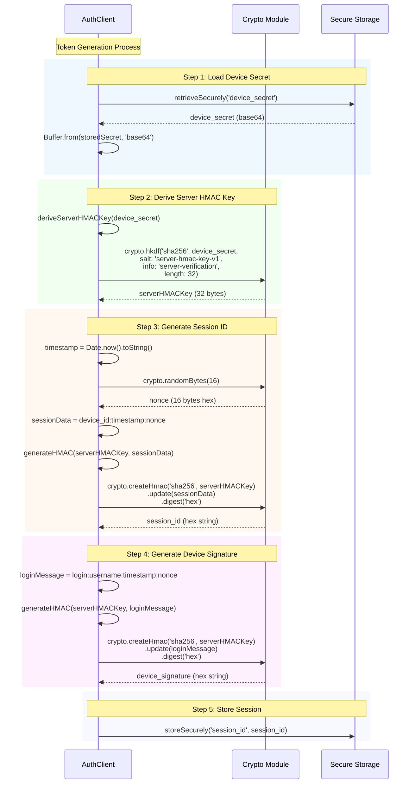
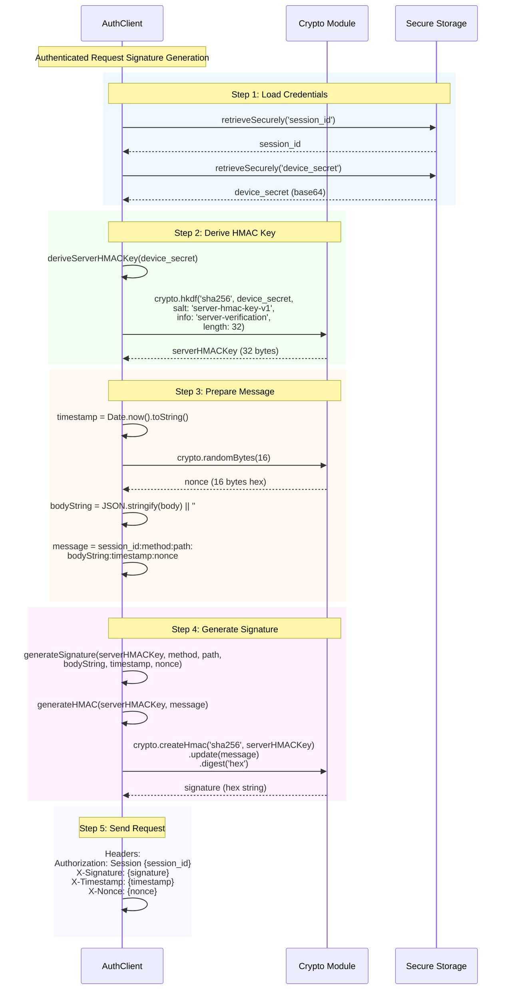
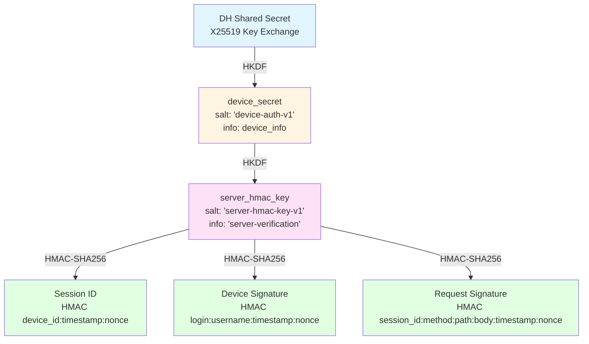

# Authentication Flow - Mermaid Sequence Diagram

## Complete Authentication Flow

```mermaid
sequenceDiagram
    participant Client as AuthClient
    participant Server as Auth Server
    participant Storage as Secure Storage

    Note over Client,Server: Phase 1: Device Registration (HTTPS)

    Client->>Client: generateX25519KeyPair()
    Note right of Client: Generate client private/public keypair
    
    Client->>Server: POST /auth/register-device<br/>{public_key, device_info}
    Note right of Server: [TLS protects exchange]
    
    Server->>Server: Generate server X25519 keypair
    Server->>Server: Compute shared_secret<br/>= DH(server_priv, client_pub)
    Server->>Server: deriveDeviceSecret(shared_secret, device_info)
    Note right of Server: HKDF(salt: "device-auth-v1")
    Server->>Server: deriveServerHMACKey(device_secret)
    Note right of Server: HKDF(salt: "server-hmac-key-v1")
    Server->>Storage: Store server_hmac_key in DB
    
    Server->>Client: {server_public_key, device_id}
    
    Client->>Client: Compute shared_secret<br/>= DH(client_priv, server_pub)
    Client->>Client: deriveDeviceSecret(shared_secret, device_info)
    Note right of Client: HKDF(salt: "device-auth-v1")
    Client->>Storage: storeSecurely('device_secret')
    Client->>Storage: storeSecurely('device_id')
    
    Note over Client,Server: Phase 2: Login (HTTPS)

    Client->>Storage: retrieveSecurely('device_secret')
    Client->>Storage: retrieveSecurely('device_id')
    
    Client->>Client: deriveServerHMACKey(device_secret)
    Note right of Client: HKDF(salt: "server-hmac-key-v1")<br/>Derived on demand (ephemeral)
    
    Client->>Client: Generate timestamp + nonce
    Client->>Client: sessionData = device_id:timestamp:nonce
    Client->>Client: generateHMAC(serverHMACKey, sessionData)
    Note right of Client: session_id = HMAC result
    
    Client->>Client: loginMessage = login:username:timestamp:nonce
    Client->>Client: generateHMAC(serverHMACKey, loginMessage)
    Note right of Client: device_signature = HMAC result
    
    Client->>Server: POST /auth/login<br/>{username, password, device_id,<br/>session_id, timestamp, nonce,<br/>device_signature}
    
    Server->>Storage: Lookup device by device_id
    Server->>Storage: Get server_hmac_key
    Server->>Server: Verify password
    Server->>Server: Verify device_signature
    Server->>Storage: Store session → {user_id, device_id, server_hmac_key}
    
    Server->>Client: {session_id}
    
    Client->>Storage: storeSecurely('session_id')
    
    Note over Client,Server: Phase 3: Authenticated API Request (HTTPS)

    Client->>Storage: retrieveSecurely('session_id')
    Client->>Storage: retrieveSecurely('device_secret')
    
    Client->>Client: deriveServerHMACKey(device_secret)
    Note right of Client: Derived on demand (ephemeral)
    
    Client->>Client: Generate timestamp + nonce
    Client->>Client: bodyString = JSON.stringify(body)
    Client->>Client: generateSignature(serverHMACKey, method, path,<br/>bodyString, timestamp, nonce)
    Note right of Client: message = session_id:method:path:body:<br/>timestamp:nonce<br/>signature = HMAC(serverHMACKey, message)
    
    Client->>Server: {method} {path}<br/>Headers: Authorization: Session {session_id}<br/>X-Signature: {signature}<br/>X-Timestamp: {timestamp}<br/>X-Nonce: {nonce}<br/>Body: {body}
    
    Server->>Storage: Lookup session → get server_hmac_key
    Server->>Server: Verify timestamp (within 5 min)
    Server->>Server: Verify nonce not reused
    Server->>Server: Recompute expected signature<br/>= HMAC(server_hmac_key, message)
    Server->>Server: constantTimeCompare(expected, received)
    
    alt Signature Valid
        Server->>Server: Process request
        Server->>Client: 200 OK {response_data}
    else Signature Invalid or Expired
        Server->>Client: 401 Unauthorized
        Client->>Client: clearSession()
    end
    
    Note over Client,Server: Phase 4: Logout (HTTPS)

    Client->>Client: authenticatedRequest('POST', '/auth/logout')
    Note right of Client: Uses same signature flow as Phase 3
    
    Client->>Server: POST /auth/logout<br/>(with signature)
    Server->>Storage: Invalidate session
    Server->>Client: 200 OK
    
    Client->>Client: clearSession()
    Client->>Storage: Remove session_id
    Note right of Client: device_secret remains stored
```

## Token Generation Flow (Detailed)

```mermaid
sequenceDiagram
    participant Client as AuthClient
    participant Crypto as Crypto Module
    participant Storage as Secure Storage

    Note over Client: Token Generation Process

    rect rgb(240, 248, 255)
        Note over Client,Storage: Step 1: Load Device Secret
        Client->>Storage: retrieveSecurely('device_secret')
        Storage-->>Client: device_secret (base64)
        Client->>Client: Buffer.from(storedSecret, 'base64')
    end

    rect rgb(240, 255, 240)
        Note over Client,Crypto: Step 2: Derive Server HMAC Key
        Client->>Client: deriveServerHMACKey(device_secret)
        Client->>Crypto: crypto.hkdf('sha256', device_secret,<br/>salt: 'server-hmac-key-v1',<br/>info: 'server-verification',<br/>length: 32)
        Crypto-->>Client: serverHMACKey (32 bytes)
    end

    rect rgb(255, 248, 240)
        Note over Client,Crypto: Step 3: Generate Session ID
        Client->>Client: timestamp = Date.now().toString()
        Client->>Crypto: crypto.randomBytes(16)
        Crypto-->>Client: nonce (16 bytes hex)
        Client->>Client: sessionData = device_id:timestamp:nonce
        Client->>Client: generateHMAC(serverHMACKey, sessionData)
        Client->>Crypto: crypto.createHmac('sha256', serverHMACKey)<br/>.update(sessionData)<br/>.digest('hex')
        Crypto-->>Client: session_id (hex string)
    end

    rect rgb(255, 240, 255)
        Note over Client,Crypto: Step 4: Generate Device Signature
        Client->>Client: loginMessage = login:username:timestamp:nonce
        Client->>Client: generateHMAC(serverHMACKey, loginMessage)
        Client->>Crypto: crypto.createHmac('sha256', serverHMACKey)<br/>.update(loginMessage)<br/>.digest('hex')
        Crypto-->>Client: device_signature (hex string)
    end

    rect rgb(248, 248, 255)
        Note over Client,Storage: Step 5: Store Session
        Client->>Storage: storeSecurely('session_id', session_id)
    end
```

## Request Signature Generation Flow

```mermaid
sequenceDiagram
    participant Client as AuthClient
    participant Crypto as Crypto Module
    participant Storage as Secure Storage

    Note over Client: Authenticated Request Signature Generation

    rect rgb(240, 248, 255)
        Note over Client,Storage: Step 1: Load Credentials
        Client->>Storage: retrieveSecurely('session_id')
        Storage-->>Client: session_id
        Client->>Storage: retrieveSecurely('device_secret')
        Storage-->>Client: device_secret (base64)
    end

    rect rgb(240, 255, 240)
        Note over Client,Crypto: Step 2: Derive HMAC Key
        Client->>Client: deriveServerHMACKey(device_secret)
        Client->>Crypto: crypto.hkdf('sha256', device_secret,<br/>salt: 'server-hmac-key-v1',<br/>info: 'server-verification',<br/>length: 32)
        Crypto-->>Client: serverHMACKey (32 bytes)
    end

    rect rgb(255, 248, 240)
        Note over Client,Crypto: Step 3: Prepare Message
        Client->>Client: timestamp = Date.now().toString()
        Client->>Crypto: crypto.randomBytes(16)
        Crypto-->>Client: nonce (16 bytes hex)
        Client->>Client: bodyString = JSON.stringify(body) || ''
        Client->>Client: message = session_id:method:path:<br/>bodyString:timestamp:nonce
    end

    rect rgb(255, 240, 255)
        Note over Client,Crypto: Step 4: Generate Signature
        Client->>Client: generateSignature(serverHMACKey, method, path,<br/>bodyString, timestamp, nonce)
        Client->>Client: generateHMAC(serverHMACKey, message)
        Client->>Crypto: crypto.createHmac('sha256', serverHMACKey)<br/>.update(message)<br/>.digest('hex')
        Crypto-->>Client: signature (hex string)
    end

    rect rgb(248, 248, 255)
        Note over Client: Step 5: Send Request
        Client->>Client: Headers:<br/>Authorization: Session {session_id}<br/>X-Signature: {signature}<br/>X-Timestamp: {timestamp}<br/>X-Nonce: {nonce}
    end
```

## Key Derivation Hierarchy

```mermaid
graph TD
    A[DH Shared Secret<br/>X25519 Key Exchange] -->|HKDF| B[device_secret<br/>salt: 'device-auth-v1'<br/>info: device_info]
    B -->|HKDF| C[server_hmac_key<br/>salt: 'server-hmac-key-v1'<br/>info: 'server-verification']
    C -->|HMAC-SHA256| D[Session ID<br/>HMAC device_id:timestamp:nonce]
    C -->|HMAC-SHA256| E[Device Signature<br/>HMAC login:username:timestamp:nonce]
    C -->|HMAC-SHA256| F[Request Signature<br/>HMAC session_id:method:path:body:timestamp:nonce]
    
    style A fill:#e1f5ff
    style B fill:#fff4e1
    style C fill:#ffe1f5
    style D fill:#e1ffe1
    style E fill:#e1ffe1
    style F fill:#e1ffe1
```
